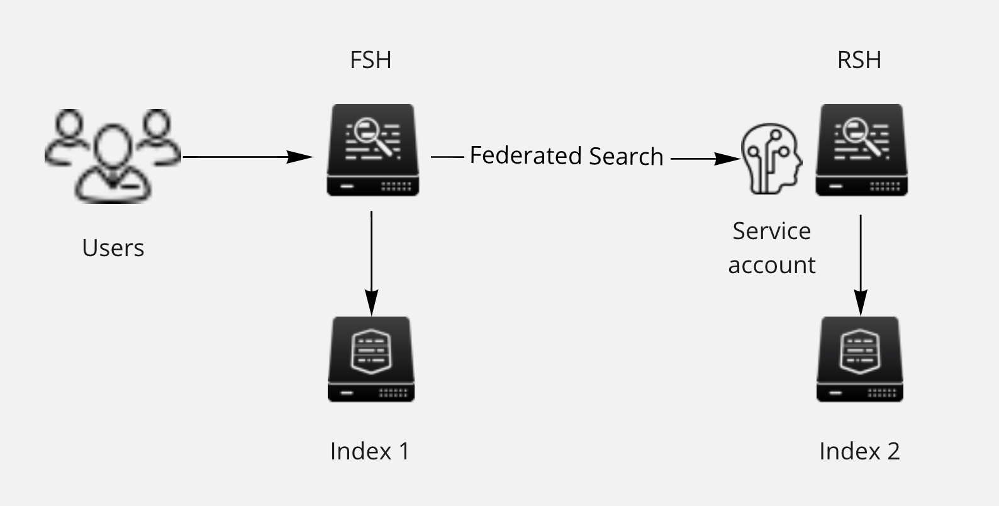

# Overview



# Environment
In this demo environment we will use following set up:

Remote Search Head (RSH) at http://localhost:8002/

Federated Search Head (FSH) at http://localhost:8001/

# Set up federation:
#### On **RSH** Create index called index2

>Under the meny Settings, Indexes, New Index

#### Create service account called ```fsuser``` with password ```fsuserfsuser```. Uncheck change password.

>Under the meny Settings, Users, New User

#### Populate some data with following search:
```
| makeresults count=86400
| streamstats count as int
| eval gauge_foobar=random() % 10 + 1
| eval _time=_time-int
| eval host="rsh"
| fields gauge_foobar host _time
| collect index=index2 source=sample_rsh
```

#### On **FSH**, set up federated search provider:

>Under the meny Settings, Federated search, Add Federated Provider

```
rsh
172.16.239.11:8089
fsuser
fsuserfsuser
```

#### Set up federated index:

>Under the meny Settings, Federated search, Federated Indexes, Add Federated Index

```
index2
rsh
index2
```
#### Verify the federation
```
index=federated:index2
```
#### Show correlation, create on **FSH** an index called index1

>Under the meny Settings, Indexes, New Index

#### Populate it with data:
```
| makeresults count=86400
| streamstats count as int
| eval gauge_foobar=random() % 10 + 1
| eval _time=_time-int
| eval host="fsh"
| fields gauge_foobar host _time
|collect index=index1 source=sample_fsh
```

#### Run a timechart:
```
| union
  [ search index = federated:index2  ]
  [ search index = index1]
  |timechart avg(gauge_foobar) as gauge by host
```
